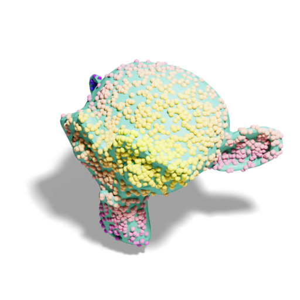
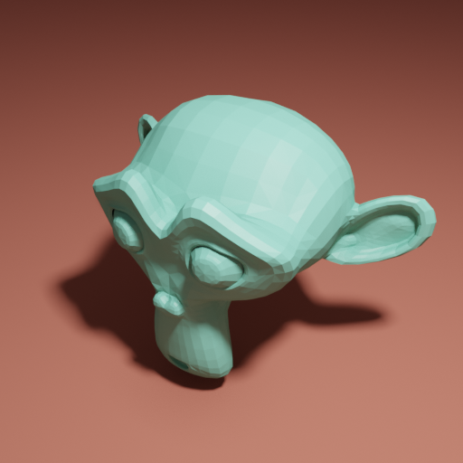
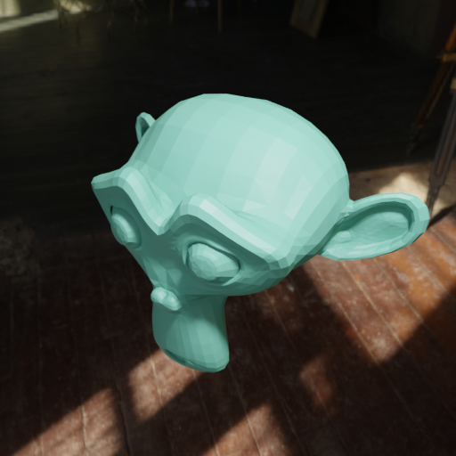
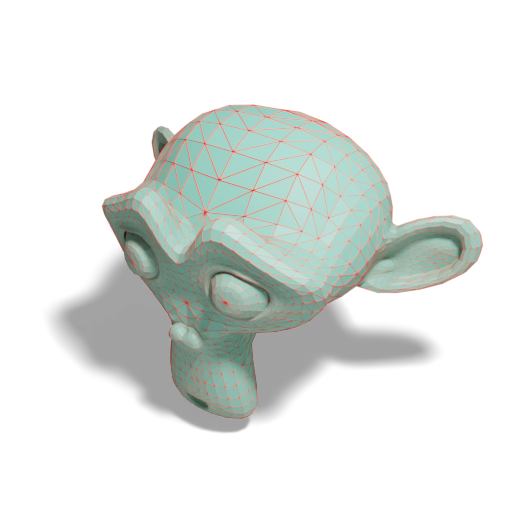

# [BlenderProc](https://github.com/DLR-RM/BlenderProc) Publication Visualization

Publication-ready visualization of 3D objects and point clouds in seconds.

| Mesh                       | Point Cloud              | Mesh + Depth                           |
|----------------------------|--------------------------|----------------------------------------|
|  |  |  |

> **Design philosophy:** Following [Andrej Karpathy](https://github.com/karpathy) and KISS.

## Installation

Use the BlenderProc-managed Blender (the only supported workflow):

```bash
pip install git+https://github.com/hummat/bproc-pubvis.git
blenderproc pip install loguru tyro
```

The first call of `blenderproc` will download [`Blender`](https://blender.org). If you already have a local
installation, you can use
`--custom-blender-path path/to/blender` (this also needs to be used for all subsequent calls of `blenderproc`).

## Basic Usage

To render a mesh (or point cloud if the input is one), simply run:

```bash
blenderproc run main.py path/to/3d.obj
```

The following options can be added to:

* **save** the rendered image: `--save path/to/output.png`
* **export** the object: `--export path/to/output.obj` (use `.glb` for a web-friendly format)
* render the mesh as **point cloud**: `--pcd True` (or a target count, e.g. `--pcd 2048`)
* render the mesh as **depth** image: `--depth ray_trace` (use `z_buffer` for Blender’s z-buffer)
* render the mesh as **point cloud** from projected **depth** image: `--pcd True` `--depth ray_trace`
* keep the mesh when rendering as point cloud or wireframe: `--keep-mesh` (used in the _Mesh + Depth_ example above)
* create an **animation**: `--animate turn` (use `--frames` for length, default `72`, and `--fps` for playback speed, default `20`)

You can test you render settings using any of the `Blender` primitives (`monkey`, `cube`, `sphere`, `cone`,
`cylinder`, ...) as the first argument.

Use `blenderproc run main.py -- --help` to see all available options and their descriptions (the `--` passes flags through BlenderProc to Tyro).

| Mesh                                     | Point cloud                   | Depth                                      |
|------------------------------------------|-------------------------------|--------------------------------------------|
|                |       |           |
| `suzanne` (primitive, positional)        | `--pcd True` `--light very_bright` | `--pcd 1024` `--point-size 0.01` `--depth ray_trace` `--keep-mesh` |

## Basic Options

* `--resolution`: Change the resolution of the rendered image (default: `512x512`)
* `--center`: Center the object inside a unit cube (enabled by default)
* `--scale`: Scale the object to fit into a unit cube (enabled by default)
* `--rotate`: Rotate the object using `XYZ` Euler angles in degrees (default: `[0,0,-35]`)
* `--show`: Show the rendered image in a window (enabled by default if `--save` is not provided)
* `--cam-location`: Set the camera location (default: `[1.5,0,1]`)
* `--cam-offset`: By default, the camera looks at the origin `[0,0,0]`. Use this option to change the look-at point.

## Additional Options

Some examples of additional options to customize the rendering are shown below.

### Color

To change the color of the rendered object, use the `--color` option using either any of the predefined colors (e.g.
`pale_violet`), choosing from those at random (`random_color`), a completely random color (`random`), or a three-tuple
of RGB values in range 0-1, e.g `0.8 0.5 0.2`. Any of the
`matplotlib` [colormaps](https://matplotlib.org/stable/users/explain/colors/colormaps.html) can be used as well.
The background color can be changed using the `--bg-color` option.

> Note: Use `--seed None` (or any changing integer) for non-deterministic results; default is `1337`.

| Mesh                             | Point cloud                    | Background                           |
|----------------------------------|--------------------------------|--------------------------------------|
|  |  |  |
| `--color bright_blue`            | `--pcd True` `--color cool`         | `--bg-color pale_turquoise`          |

### Background

By default, the background is transparent. To change this, use the `--bg-color` option as shown above. Additionally,
set `--transparent False` to render the backdrop object. To use HDRI images as backdrops, use `--backdrop path/to/hdri`.
HDRIs can be obtained e.g. via `blenderproc download haven path/to/save/dir`.

| Backdrop                           | Colored backdrop                           | HDRI backdrop                               |
|------------------------------------|--------------------------------------------|---------------------------------------------|
|  |  |                   |
| `--transparent False`              | `--transparent False` `--bg-color pale_red`| `--transparent False` `--backdrop path/to/hdri` |

## Light

The default light intensity for meshes is `bright` (`0.7`) and `very_bright` (`1.0`) for point clouds. Use a value
between 0 and 1 or `very_dark`, `dark`, `medium`, `bright`, or `very_bright` to change the light intensity.

| Very Dark                            | Dark                       | Medium                         |
|--------------------------------------|----------------------------|--------------------------------|
|  |  |  |
| `--light very_dark`                  | `--light dark`             | `--light medium`               |

### Shadow

Shadows are rendered by default. To disable them, use the `--shadow off` option. To make the shadow softer, use
`--shadow soft` or `--shadow hard` for a harder shadow.

| Soft shadow                       | Hard shadow                       | No shadow                           |
|-----------------------------------|-----------------------------------|-------------------------------------|
|  |  |  |
| `--shadow soft`                   | `--shadow hard`                   | `--shadow off`                        |

### Shading

The default shading is `flat` for meshes. Use `--shade` to change mesh shading; point clouds are unaffected by this option.

| Flat shading (default)     | Smooth shading                 | Auto-smooth shading               |
|----------------------------|--------------------------------|-----------------------------------|
|  |  |  |
|                            | `--shade smooth`               | `--shade auto`                    |

### Wireframe

To render the object as a wireframe, use the `--wireframe` option (e.g. `--wireframe True` or `--wireframe red`).
The wireframe color can be changed using `--wireframe color` when `--keep-mesh` is specified.

| Wireframe                            | Mesh + Wireframe                        | Mesh + Wireframe (Color)                            |
|--------------------------------------|-----------------------------------------|-----------------------------------------------------|
|  |  |  |
| `--wireframe True`                        | `--wireframe True` `--keep-mesh`             | `--wireframe red` `--keep-mesh`                     |

### Gravity

Objects hover slightly above the ground by default. To change this, use the `--gravity` option to run quick physics
simulation to let the object fall to the ground before rendering.

| Default                          | With gravity                     |
|----------------------------------|----------------------------------|
|  |  |
|                                  | `--gravity`                      |

### Animations

To create an animation, use the `--animate` option. Control length with `--frames` (default: `72`) and playback speed with `--fps` (default: `20`). To keep transparency, which is not supported by GIF, use `.mp4` as file extension.

| Turn (default, loops)      | Tumble                         |
|----------------------------|--------------------------------|
|  |  |
| `--animate turn`                | `--animate tumble`             |

### Interactive 3D Visualization

To provide an interactive 3D visualization, use `--export path/to/mesh.glb` to export the object as a `.glb` file and
use

```html
<script type="module" src="https://ajax.googleapis.com/ajax/libs/model-viewer/4.1.0/model-viewer.min.js"></script>

<style>
model-viewer {
  width: auto;
  height: 300px;
  display: block;
  margin-left: auto;
  margin-right: auto;
}
</style>

<model-viewer 
  src="path/to/mesh.glb" 
  camera-controls tone-mapping="neutral" 
  shadow-intensity="1" 
  auto-rotate>
</model-viewer>
```

in any HTML file to display the object:

<script type="module" src="https://ajax.googleapis.com/ajax/libs/model-viewer/4.1.0/model-viewer.min.js"></script>

<style>
model-viewer {
  width: auto;
  height: 300px;
  display: block;
  margin-left: auto;
  margin-right: auto;
}
</style>

<model-viewer
  src="examples/suzanne.glb"
  camera-controls tone-mapping="neutral"
  shadow-intensity="1"
  auto-rotate>
</model-viewer>

### Further Options

Some additional useful options include:

* `--roughness`: Change the roughness of the object. Meshes use `0.5` and point clouds `0.9` by default.
* `--ao`: Apply ambient occlusion (_on_ for meshes, _off_ for point clouds by default)
* `--fstop`: Enable depth of field with a given f-stop
* `--keep-material`: Keep your custom material (only works for `.blend` files)
* `--point-size`: Change the size of the points in the point cloud
* `--point-shape`: Change the shape of the points in the point cloud (`sphere`, `cube`, `diamond`)
* `--verbose`: Enable verbose logging during execution
* `--seed`: Set a seed for the random number generator; use `None` to disable seeding.
* `--subsample` / `--subsample-method {random,fps}`: Reduce point counts by a target number or fraction.
* `--point-color`: Explicit point color when differing from mesh color.
* `--bg-light`: Adjust background light intensity (default `0.15`).
* `--look`, `--engine`, `--samples`, `--noise-threshold`, `--exposure`: Advanced render controls.
* `--frames`, `--fps`: Animation length and playback speed.

Use `blenderproc run main.py` to see all available options and their descriptions.

## Development

This repository is `pyproject.toml`-based and works well with [`uv`](https://github.com/astral-sh/uv):

- Create the env once: `uv sync --group dev` (installs the app plus dev tools and `fake-bpy-module` stubs for local tests).
- After any code change, run the full tooling suite:
  - Format: `uv run ruff format .`
  - Lint: `uv run ruff check .`
  - Type check: `uv run pyright`
  - Tests: `uv run pytest` (set `BPROC_INTEGRATION=1` to include integration tests)
- Re-run `uv sync --group dev` only when you intentionally want to refresh dependencies.

Integration tests exercise the BlenderProc CLI end-to-end and are opt-in:

```bash
BPROC_INTEGRATION=1 uv run pytest tests/test_integration.py
```

To regenerate the README gallery assets with your GPU/HDRI set-up, run the gallery suite (writes into `examples/` by
default). This is **opt-in** and separate from the basic integration flag:

```bash
BPROC_INTEGRATION=1 BPROC_EXAMPLES=1 \
BPROC_HAVEN_DIR=/path/to/haven \
BPROC_EXAMPLES_OUT=examples \
uv run pytest tests/test_integration.py -k readme_gallery
```

Optional env knobs:
- `BPROC_README_RES` (default `512`) to change render resolution
- `BPROC_README_FRAMES` (default `72`) to change animation length

See `AGENTS.md` for contributor-focused details (tooling, PR expectations, and how to run integration tests safely).

## Debugging

`BlenderProc` supports visual debugging inside `Blender` using `blenderproc debug` instead of `blenderproc run`.
Adding `--debug` will further disable rendering and only set up the scene.

## Credits

* [**BlenderProc 2**](https://github.com/DLR-RM/BlenderProc)


* [**Blender**](https://www.blender.org)


* [**Zheng et al.: Locally Attentional SDF Diffusion for Controllable 3D Shape Generation**](https://zhengxinyang.github.io/projects/LAS-Diffusion.html): Mesh colors and look
* [**Yang et al.: PointFlow: 3D Point Cloud Generation with Continuous Normalizing Flows**](https://www.guandaoyang.com/PointFlow): Point cloud color scheme and look
