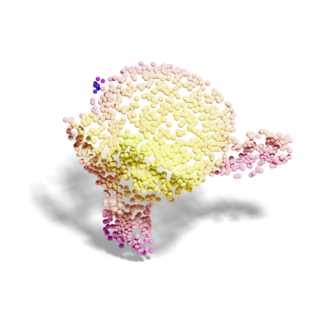
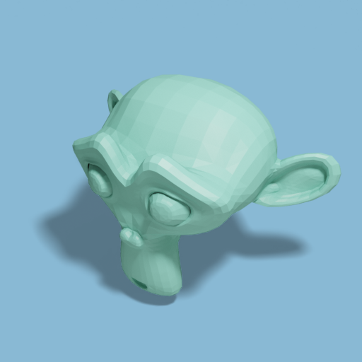
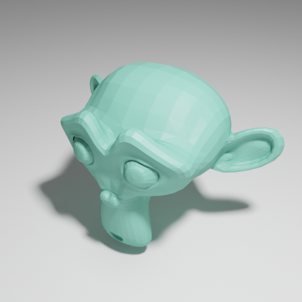
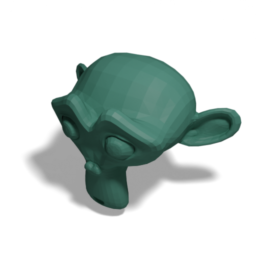
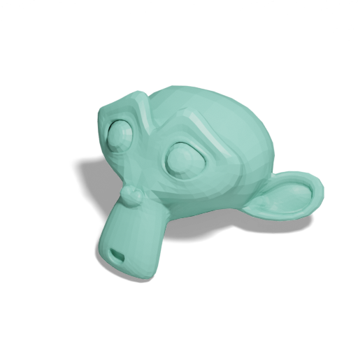

# [BlenderProc](https://github.com/DLR-RM/BlenderProc) Publication Visualization
Publication-ready visualization of 3D objects and point clouds in seconds.

| Mesh                       | Point Cloud              | Mesh + Depth                           |
|----------------------------|--------------------------|----------------------------------------|
|  |  |  |

_Head over to the repository's [**GitHub** Pages site](https://hummat.com/bproc-pubvis) for a prettier and more
interactive version of this README!_

## Installation
```bash
pip install bproc-pubvis
blenderproc pip install fire loguru
```

The first call of `blenderproc` will download [`Blender`](https://blender.org). If you already have a local 
installation, you can use 
`--custom-blender-path path/to/blender` (this also needs to be used for all subsequent calls of `blenderproc`).

## Basic Usage
To render a mesh (or point cloud if the input is one), simply run:
```bash
blenderproc run main.py path/to/3d.obj
```
The following options can be added to:
* **save** the rendered image: `--save path/to/output.png`
* **export** the object: `--export path/to/output.obj` (use `.glb` for a web-friendly format)
* render the mesh as **point cloud**: `--pcd`
* render the mesh as **depth** image: `--depth`
* render the mesh as **point cloud** from projected **depth** image: `--pcd` `--depth`

You can test you render settings using any of the `Blender` primitives (`monkey`, `cube`, `sphere`, `cone`, 
`cylinder`, ...) as the first argument.

| Mesh                                     | Point cloud                   | Depth                                      |
|------------------------------------------|-------------------------------|--------------------------------------------|
|                |       |           |
| `--obj_path suzanne` (or just `suzanne`) | `--pcd` `--light very_bright` | `--pcd 1024` `--point_size 0.01` `--depth` |

## Basic Options

* `--resolution`: Change the resolution of the rendered image (default: `512x512`)
* `--normalize`: Normalize and center the object to fit into a unit cube (`True` by default)
* `--rotate`: Rotate the object using `XYZ` Euler angles in degrees (default: `0,0,-35`)
* `--show`: Show the rendered image in a window (`True` if `--save` is not provided)
* `--cam_location`: Set the camera location (default: `1.5,0,1`)
* `--cam_offset`: By default, the camera looks at the origin (`0,0,0`). Use this option to change the look-at point.

## Additional Options

Some examples of additional options to customize the rendering are shown below.

### Color

To change the color of the rendered object, use the `--color` option using either any of the predefined colors (e.g. 
`pale_violet`), choosing from those at random (`random_color`), a completely random color (`random`), or a three-tuple
of RGB values in range 0-1, e.g (`0.8,0.5,0.2`). Point clouds can additionally be colored using any of the 
`matplotlib` [colormaps](https://matplotlib.org/stable/users/explain/colors/colormaps.html). The background color can be
changed using the `--bg_color` option.

| Mesh                             | Point cloud                    | Background                           |
|----------------------------------|--------------------------------|--------------------------------------|
|  |  |  |
| `--color bright_blue`            | `--pcd` `--color cool`         | `--bg_color pale_turquoise`          |

### Background

By default, the background is transparent. To change this, use the `--bg_color` option as shown above. Additionally, 
`--notransparent` can be used to render the backdrop object. To use HDRI images as backdrops, use `--backdrop path/to/hdri`.
HDRIs can be obtained e.g. via `blenderproc download haven path/to/save/dir`.

| Backdrop                       | Colored backdrop                      | HDRI backdrop                                                      |
|--------------------------------|---------------------------------------|--------------------------------------------------------------------|
|  |  |                                    |
| `--notransparent`              | `--notransparent` `--bg_color pale_red` | `--notransparent` `--backdrop path/to/hdri` |

## Light

The default light intensity for meshes is `bright` (`0.7`) and `very_bright` (`1.0`) for point clouds. Use a value 
between 0 and 1 or `very_dark`, `dark`, `medium`, `bright`, or `very_bright` to change the light intensity.

| Very Dark                       | Dark                      | Medium                             |
|---------------------------------|---------------------------|------------------------------------|
|  |  |  |
| `--light very_dark`             | `--light dark`            | `--light medium`                   |

### Shadow

Shadows are rendered by default. To disable them, use the `--noshadow` option. To make the shadow softer, use 
`--shadow soft` or `--shadow=hard` for a harder shadow.

| Soft shadow                       | Hard shadow                      | No shadow                            |
|-----------------------------------|----------------------------------|--------------------------------------|
|  |  |  |
| `--shadow soft`                   | `--shadow hard`                  | `--noshadow`                         |

### Shading

The default shading is `flat` for meshes and `smooth` for point clouds. To change this, use the `--shade` option.

| Smooth shading               | Auto-smooth shading              |
|------------------------------|----------------------------------|
|  |  |
| `--shade smooth`             | `--shade auto`                   |

### Gravity

Objects hover slightly above the ground by default. To change this, use the `--gravity` option to run quick physics
simulation to let the object fall to the ground before rendering.

| Default                    | With gravity                      |
|----------------------------|-----------------------------------|
|  |       |
|                            | `--gravity`                       |

### Animations

To create an animation, use the `--animate` option. The `--frames` option can be used to specify the number of frames
(default: `72`). To keep transparency, which is not supported by GIF, use `.mp4` as file extension.

| Turn (default, loops)      | Tumble                      |
|----------------------------|-----------------------------|
|  |  |
| `--animate`                | `--animate tubmle`          |

### Interactive 3D Visualization

To provide an interactive 3D visualization, use `--export path/to/mesh.glb` to export the object as a `.glb` file and
use
```html
<script 
    type="module" 
    src="https://ajax.googleapis.com/ajax/libs/model-viewer/3.5.0/model-viewer.min.js">
</script>

<style>
model-viewer {
    width: 512px;
    height: 512px;
    display: block;
    margin-left: auto;
    margin-right: auto;
}
</style>

<model-viewer 
    src="path/to/mesh.glb" 
    camera-controls tone-mapping="neutral" 
    shadow-intensity="1" 
    auto-rotate>
</model-viewer>
```
in any HTML file (like the hosted [**GitHub** Pages site](https://hummat.com/bproc-pubvis) of this repository) to display the object.

### Further Options

Some additional useful options include:

* `--roughness`: Change the roughness of the object. Meshes use `0.5` and point clouds `0.9` by default.
* `--ao`: Apply ambient occlusion (_on_ for meshes, _off_ for point clouds by default)
* `--fstop`: Enable depth of field with a given f-stop
* `--keep_material`: Keep your custom material (only works for `.blend` files)
* `--point_size`: Change the size of the points in the point cloud
* `--point_shape`: Change the shape of the points in the point cloud (`sphere`, `cube`, `diamond`)
* `--verbose`: Enable verbose logging during execution
* `--seed`: Set a seed for the random number generator. Useful for random colors or the tumble animation.

## Debugging

`BlenderProc` supports visual debugging inside `Blender` using `blenderproc debug` instead of `blenderproc run`. 
Adding `--debug` will further disable rendering and only set up the scene.

## Credits

| [**BlenderProc 2**](https://github.com/DLR-RM/BlenderProc)                                                                                     | [**Blender**](https://www.blender.org)                                                              |
|------------------------------------------------------------------------------------------------------------------------------------------------|-----------------------------------------------------------------------------------------------------|
|  |  | |
