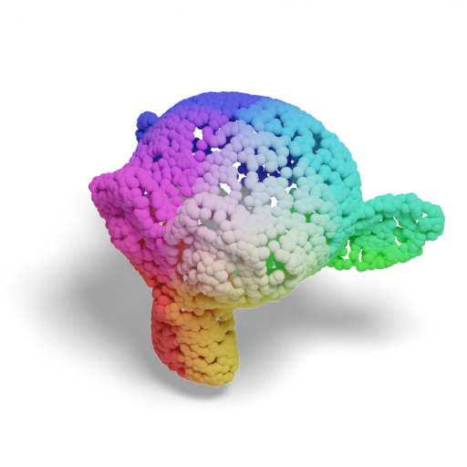

# BlenderProc Publication Visualization
Publication-ready visualization of 3D objects and point clouds in seconds.

| Mesh                            | Point Cloud                   | Mesh + Depth                           |
|---------------------------------|-------------------------------|----------------------------------------|
|  |  |  |

_Head over to the repository's [**GitHub** Pages site](https://hummat.com/bproc-pubvis) for a prettier and more
interactive version of this README!_

## Installation
```bash
pip install bproc-pubvis
blenderproc pip install fire loguru
```

## Basic Usage
```bash
blenderproc run main.py --obj_path /path/to/3d.obj --save /path/to/output.png
```

## Examples

To render a mesh, simply run:
```bash
blenderproc run main.py --obj_path path/to/mesh.obj
```
The following options can be added to:
* **save** the rendered image: `--save path/to/output.png`
* **export** the object: `--export path/to/output.obj` (use `.glb` to get web-friendly format)
* Render the mesh as **point cloud**: `--pcd`
* Render the mesh as **depth** image: `--depth`
* Render the mesh as **point cloud** from projected **depth** image: `--pcd --depth`

| Mesh                            | Point cloud                                         | Mesh + Depth                                          |
|---------------------------------|-----------------------------------------------------|-------------------------------------------------------|
|  |  |  |
| `--obj_path suzanne`            | `--mesh_as_pcd`                                     | `--depth`                                             |

## Credits

| [**BlenderProc 2**](https://github.com/DLR-RM/BlenderProc)                                                                                     | [**Blender**](https://www.blender.org)   |
|------------------------------------------------------------------------------------------------------------------------------------------------|-----------------------------------------------------------------------------------------------------|
|  |  | |